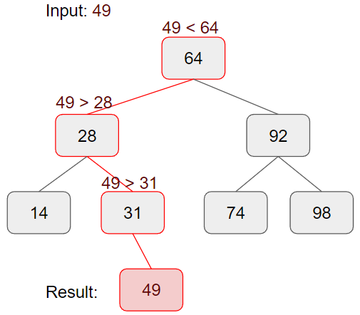
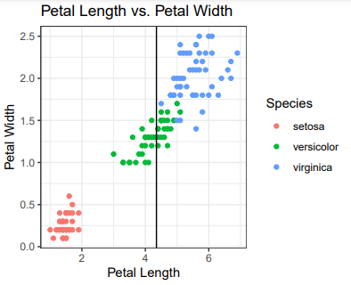
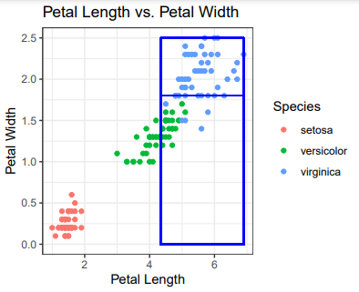
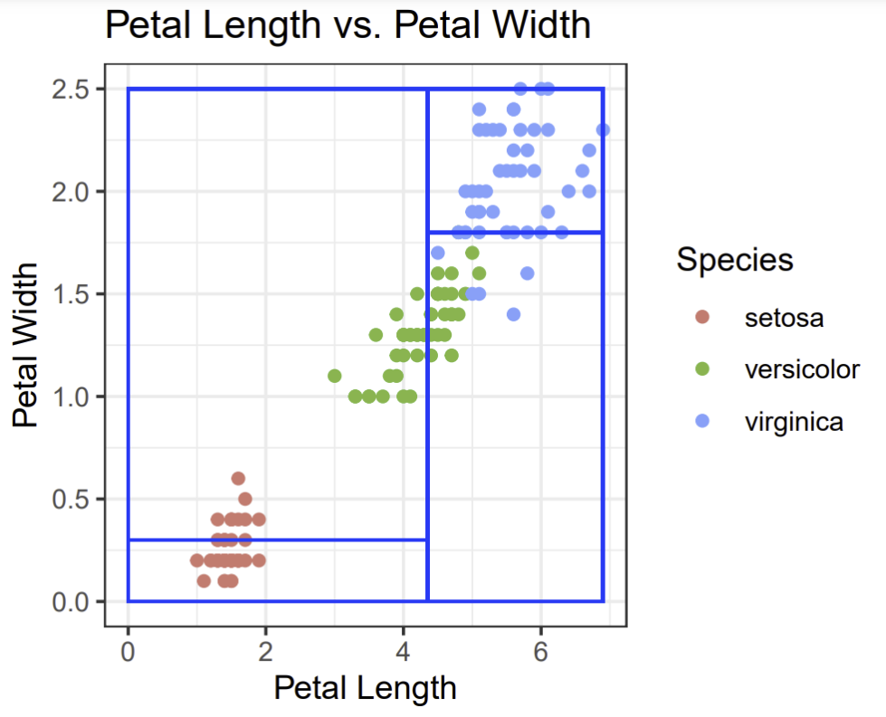
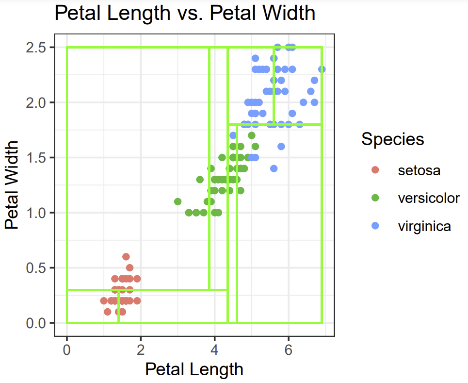
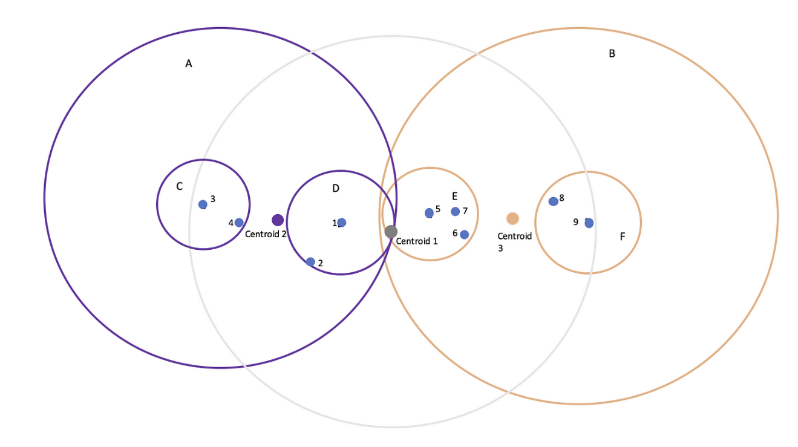
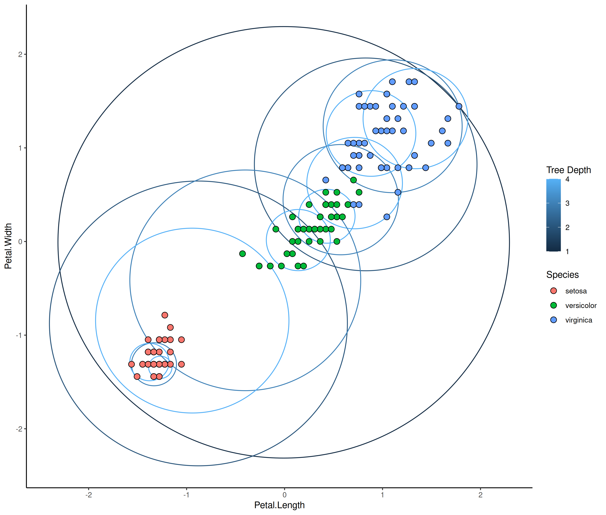
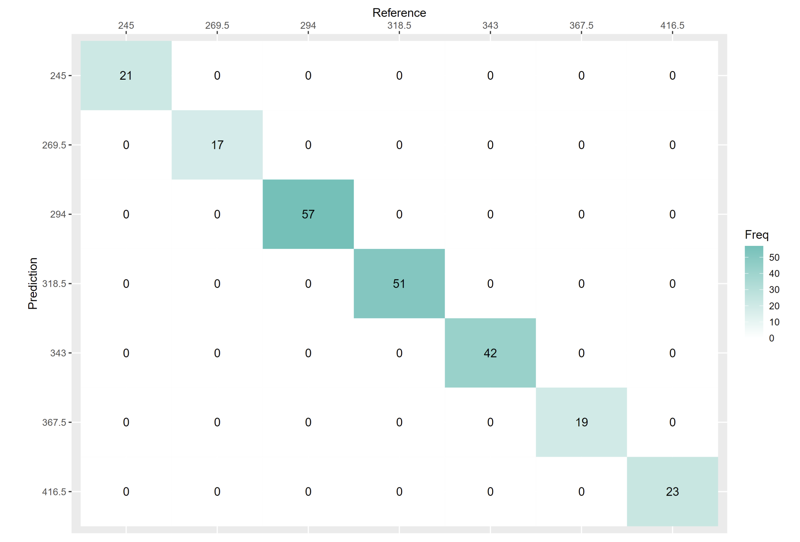

+++
author = "Matt Beneventano, Nicolas Gonzalez, Jacob Hodges, William Kim, James Lawton"
title = "KD Trees and Ball Trees"
date = "2023-04-25"
description = "Guides to using KD and Ball Trees for kNN and data visualization."
tags = [
    "R",
    "Markdown"
]
categories = [
    "Data Science",
    "Data Visualization",
    "Data Analysis",
]
image = "img/ball_tree_diagram.jpg"
math = true
+++


## Motivation

Imagine we are interested in determining the CMDA 4654 classmate that lives nearest to us. The “brute force” approach would be to ask each classmate where they live (i.e. make the search region , compute the distance between their house and ours, and then select the minimum distance. This is quite computationally expensive. In fact, it has a time complexity of O(2n), assuming 2-dimensional distance computations. \
\
A better approach might be to partition the class into different groups based on the broader attributes of their location. For instance, we can ask everyone who lives in Blacksburg to stand on one side of the classroom, while those that don’t (i.e. live in Christiansburg) stand on the other. Then, if we live in Blacksburg, we are able to reduce the size of the group that we compute our distance to. \
\
We can continue to partition the group based on other factors (i.e. on-campus vs off-campus, north vs south, etc) to further reduce the size of the search group. Then, the time complexity of our algorithm is going to be O(n+log(n)), which is much better than vanilla kNN.\
\
However, we might find someone who lives on the edge of campus and whose nearest neighbor is off-campus, which will never be found due to the clustering nature of this algorithm.\
\
This idea of partitioning the data into subsets that will later be used to search for nearest neighbor within that subset (and hope that it’s the global nearest neighbor) is the idea behind clustering using k-d trees and ball trees.

## Intro to Decision Trees

A tree is a common data structure composed of a hierarchical structure with branch nodes, and leaf nodes. They can be useful for providing a visual representation for a data set or model. \
\
A binary tree is one of the simplest implementations of the structure. It’s simply a way of storing a set of ordered data. The rules that make up a binary tree are as follows:\
\

- Each node must have at most 2 children
- A node’s left child must come before it
- A node’s right child must come after it.

Using these simple rules, we can create a data structure that is computationally efficient to retrieve data from.\

Notice that each node in this example tree not only stores a data point, but it also represents a decision that each incoming data point has to make as it goes through the tree. Whether the result of this decision is true or false determines which direction the point will move next.



---

## KD Trees

A K-D tree (or a K-dimensional tree) is a special type of decision tree that can organize data for efficient spatial search or nearest-neighbor search within K-dimensional space.\
\
In data modeling, each one of K dimensions normally represents a specific feature of the data set.\
\
The basic idea of k-d trees is to partition our feature space along the axes and prune subtrees that are too far away from our nearest neighbor(s) (essentially depth first search with pruning). 

![KD Trees [Source: Carnegie Mellon]](img/kdtrees_pic.png) 

## Process

The basic idea of k-d trees is to partition our feature space along the axes and prune subtrees that are too far away from our nearest neighbor(s).\
\

- We construct the tree by partitioning our data into halves along one feature
- We then rotate through our features based on which of them have the largest maximum variance and continue partitioning our data.

\
When considering a test point and its nearest neighbors, we calculate the distance between them, call it $x_d$
\

- Compare $x_d$ to the distance between the point and the partition, $x_p$
- If $x_p > x_d$, we can prune that subtree
- If $x_p < x_d$, recalculate nearest neighbor

\
Continue until all leaf nodes have been visited.

## Limitations

K-d trees are really only effective in low dimensional spaces and is not very accurate in high dimensional spaces.\
\

- In higher dimensions, the points end up being close to every partition (i.e. a million partition lines)
- Partitions are along axes and span the entire feature space, which proves to be problematic as the number of features grows
- Nearest neighbors begins to lose meaning since the distance between the closest and farthest point are very similar.


## Example: The IRIS Dataset

We will use the Iris data to demonstrate KD trees using 



---



---



---

Code to draw these rectangles in R:

```{r, fig.show='hide'}
library(ggplot2)

ggplot(iris, aes(x=Petal.Length, y=Petal.Width, col=Species)) + geom_point() + 
  labs(x="Petal Length", y="Petal Width", title = "Petal Length vs. Petal Width") + theme_bw() + 
  #geom_vline(xintercept = median(iris$Petal.Length)) + 
  geom_rect(aes(xmin=4.35, xmax=6.9, ymin=1.8, ymax=2.5), fill=NA, color="blue", alpha=0.25) + 
  geom_rect(aes(xmin=4.35, xmax=6.9, ymin=0, ymax=1.8), fill=NA, color="blue", alpha=0.25) + 
  geom_rect(aes(xmin=0, xmax=4.35, ymin=0.3, ymax=2.5), fill=NA, color="blue", alpha=0.25) + 
  geom_rect(aes(xmin=0, xmax=4.35, ymin=0, ymax=0.3), fill=NA, color="blue", alpha=0.25) + 
  geom_rect(aes(xmin=3.85, xmax=4.35, ymin=0.3, ymax=2.5), fill=NA, color="green", alpha=0.25) +
  geom_rect(aes(xmin=0, xmax=3.85, ymin=0.3, ymax=2.5), fill=NA, color="green", alpha=0.25) + 
  geom_rect(aes(xmin=0, xmax=1.4, ymin=0, ymax=0.3), fill=NA, color="green", alpha=0.25) + 
  geom_rect(aes(xmin=1.4, xmax=4.35, ymin=0, ymax=0.3), fill=NA, color="green", alpha=0.25) + 
  geom_rect(aes(xmin=4.35, xmax=4.6, ymin=0, ymax=1.8), fill=NA, color="green", alpha=0.25) + 
  geom_rect(aes(xmin=4.6, xmax=6.9, ymin=0, ymax=1.8), fill=NA, color="green", alpha=0.25) + 
  geom_rect(aes(xmin=4.35, xmax=5.6, ymin=1.8, ymax=2.5), fill=NA, color="green", alpha=0.25) +
  geom_rect(aes(xmin=5.6, xmax=6.9, ymin=1.8, ymax=2.5), fill=NA, color="green", alpha=0.25)

```

---




## Ball trees

A ball tree is a space partitioning data structure for organizing points in a multidimensional space. \
\
Each internal node partitions the data into two disjoint sets which are associated with different balls. Each point is assigned to the ball with the closest center. 


$$ 
    D^B (t) = 
    \begin{cases}
        \max( |t - B.pivot | - B.radius, D^{B.parent} ),\quad \text{ if }B \neq R \\
        \max( |t - B.pivot | - B.radius, D^{B.parent}, 0 ), \text{ if }B = R \\
    \end{cases}
$$





## Motivation

The ball tree algorithm is similar to k-d trees in that they both partition in terms of the feature space, but unlike k-d trees, the trees are partitioned into hyperplane spheres instead of boxes. \
\
While ball tree performance may suffer in lower dimensional feature spaces, 
Ball tree performance of with O(n log(n)) is still better than kNN training speed of O(nd) 

## Example: The IRIS dataset

```{r, fig.show = 'hide', results = F, warning = F}
source("ball_tree.R")
 # scales all numeric columns
iris_scaled <- iris %>%
  mutate_if(is.numeric, scale)

#                    columns to plot
isc <- iris_scaled[, c(3:4)]

# builds the tree
bt <- build_ball_tree(isc, c(1:nrow(isc), min_points = 2))

ggplot() + geom_balltree(bt, max_depth = 4) +
    geom_point(
        data = iris_scaled,
        pch = 21,
        size = 3,
        aes(x = Petal.Length, y = Petal.Width, fill = Species)
    ) +
    theme_classic() + scale_colour_stepsn(colors = c("purple4","red","orange1"))
```

---



## Housing Data

The housing data we chose to use analyzed 12 different building shapes. Each building differs with respect to the glazing area, the glazing area distribution, and the orientation, amongst other parameters. With the data being found [here](https://drive.google.com/drive/u/1/folders/1W_Qc1XoOJUjNWN14925pfaIVZKvrBahP).

| Name | Definition |
| -- | -- |
| X1 | Relative Compactness |
| X2 | Surface Area |
| X3 | Wall Area |
| X4 | Roof Area |
| X5 | Overall Height |
| X6 | Orientation |
| X7 | Glazing Area |
| X8 | Glazing Area Distribution |
| y1 | Heating Load |
| y2 | Cooling Load |

## KD tree approach

```{r, results = F, message = F, warning = F}
library(FNN)
library(caret)
house = read.csv("data/ENB2012_data.csv")

house1 = house[c(1:768),-c(6,8)]

index <- sample(1:nrow(house1), round(nrow(house1) * 0.7))
training_df <- house1[index, ]
testing_df <- house1[-index, ]
# Store the training/testing data features
train_features <- training_df[,-3]
test_features <- testing_df[, -3]

# Store the actual labels
train_classes <- training_df$X3
test_classes <- testing_df$X3

house_kd = knn(train = train_features, test = test_features, cl = train_classes, k = 5, algorithm=c("kd_tree"))

confusionMatrix(data = house_kd, reference = as.factor(test_classes))
```

## Confusion Matrix

```{r, fig.show = "hide"}
confusion.table = table("predicted" = house_kd, "actual" = as.factor(test_classes))

plt <- as.data.frame(confusion.table)
plt$predicted <- factor(plt$predicted, levels=rev(levels(plt$predicted)))

ggplot(plt, aes(actual,predicted, fill= Freq)) +
        geom_tile() + geom_text(aes(label=Freq)) +
        scale_fill_gradient(low="white", high="#CF4420") +
        labs(x = "Reference",y = "Prediction") +
        scale_x_discrete(labels=c("245","269.5","294","318.5","343","367.5","416.5"),  position = "top") +
        scale_y_discrete(labels=c("416.5","367.5","343","318.5","294","269.5","245"))
```

---




## Ball Tree Approach


## kNN Approach

For reference, we will show the kNN approach of classifying our data set

```{r, results = F}
knn(train = train_features, test = test_features, cl = train_classes, k = 5, algorithm=c("brute"))

```
